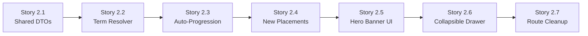

# Epic 2: Demand Engine & Auto-Progression

> **Status:** Ready for Implementation  
> **Target Scope:** `packages/types`, `apps/api`, `apps/admin-panel`  
> **Reference Architecture:** [SCHEDULING_ARCHITECTURE.md](file:///d:/projects/kalameh/docs/SCHEDULING_ARCHITECTURE.md)

---

## 📖 Executive Summary

In fast-paced language institutes (~5-week terms, <24h gap between terms), waiting for final exam grades makes scheduling impossible.

The system enforces **"Progression by Default"**:

- **Continuing Students:** Active students in Course $N$ during the current term are assumed to pass and advance to Course $N+1$ (next course in prerequisite chain).
- **New Placements:** Newly registered students with placement test results (not in current classes) are assigned to their designated starting course.

$$\text{Demand for Course Y} = (\text{Continuing from Course X}) + (\text{New Placements for Course Y})$$
$$\text{Suggested Classes} = \left\lceil \frac{\text{Demand}}{\text{Class Capacity}} \right\rceil$$

---

## 🧩 Tiny User Stories (Step-by-Step Task List)

The epic is broken down into **7 standalone, atomic user stories**. Each story can be executed and verified independently in a single AI chat session.

---

### 🔹 Story 2.1: Shared DTOs & Type Definitions

> **As a** developer  
> **I want** shared DTOs and Zod schemas to include continuing vs new placement counts  
> **So that** backend and frontend have a clear, typed contract.

- **Target Files:**
  - `packages/types/src/scheduling/demand.dto.ts` (or appropriate export in `@workspace/types`)
- **Scope of Changes:**
  - Add `continuingStudentsCount: number` to `CourseDemandSummaryDto`.
  - Add `newPlacementCount: number` to `CourseDemandSummaryDto`.
  - Add `currentTermId?: string | null` to `TermDemandReportDto`.
  - Add `totalContinuingStudents: number` and `totalNewPlacements: number` to `TermDemandReportDto`.
- **Acceptance Criteria:**
  - [ ] `packages/types` compiles cleanly (`pnpm build`).
  - [ ] Zod schema validates payloads with the new fields.

---

### 🔹 Story 2.2: Backend - Preceding Term Resolver

> **As a** scheduling service  
> **I want** to automatically identify the preceding/active term relative to the target term  
> **So that** the engine knows which term's active classes to inspect for continuing students.

- **Target Files:**
  - `apps/api/src/scheduling/scheduling-demand.service.ts`
  - `apps/api/src/scheduling/scheduling-demand.service.spec.ts`
- **Scope of Changes:**
  - Implement private method:
    ```typescript
    private async resolvePrecedingTerm(
      instituteId: string,
      targetTermStartDate: Date
    ): Promise<{ id: string; title: string } | null>
    ```
  - Query: Term with matching `instituteId`, `startDate < targetTermStartDate`, ordered by `startDate DESC`, `take: 1`.
  - Edge case: Return `null` if the target term is the institute's first term.
- **Acceptance Criteria:**
  - [ ] Returns the immediately preceding term when previous terms exist.
  - [ ] Returns `null` gracefully when no preceding term exists.
  - [ ] Unit tests written in `scheduling-demand.service.spec.ts`.

---

### 🔹 Story 2.3: Backend - Auto-Progression for Continuing Students

> **As a** supervisor  
> **I want** students actively enrolled in Course $X$ to automatically count towards Course $X+1$ demand for next term  
> **So that** I don't need to manually check student rosters or wait for final exam grading.

- **Target Files:**
  - `apps/api/src/scheduling/scheduling-demand.service.ts`
  - `apps/api/src/scheduling/scheduling-demand.service.spec.ts`
- **Scope of Changes:**
  - If a preceding term $T_{current}$ exists:
    - Query active student enrollments in $T_{current}$ with their class course ID.
    - Match each enrolled student's current course $X$ to the next course $Y$ where `Course.prerequisiteId === X.id`.
    - Increment `continuingStudentsCount` for Course $Y$.
    - Extract shifts (`MORNING`, `AFTERNOON`, `FLEXIBLE`) and day preferences (`EVEN_DAYS`, `ODD_DAYS`, `ANY`) from `studentProfile`.
  - Edge case: If Course $X$ has no next course (graduating level), student is not projected into any course.
- **Acceptance Criteria:**
  - [ ] Student in `AME 1` in Term 1 is counted as continuing student in `AME 2` for Term 2.
  - [ ] Shifts and day preferences are accurately aggregated.
  - [ ] Unit tests pass for continuing students.

---

### 🔹 Story 2.4: Backend - Placement Test Intake & Zero Double-Counting

> **As a** supervisor  
> **I want** newly tested students (who have no current class) to be included in next term's demand  
> **So that** new student registrations are instantly reflected without double-counting continuing students.

- **Target Files:**
  - `apps/api/src/scheduling/scheduling-demand.service.ts`
  - `apps/api/src/scheduling/scheduling-demand.service.spec.ts`
- **Scope of Changes:**
  - Find all active students in the institute whose `currentAllowedCourseId` is set to Course $Y$, but who have **no enrollment in $T_{current}$**.
  - Increment `newPlacementCount` for Course $Y$.
  - Combine: `eligibleStudentsCount = continuingStudentsCount + newPlacementCount`.
  - Compute suggested class count: `Math.max(1, Math.ceil(eligibleStudentsCount / defaultCapacity))` (or `0` if count is 0).
  - Guarantee: An active student in $T_{current}$ is NEVER counted as a new placement.
- **Acceptance Criteria:**
  - [ ] Newly placed students appear under their placed course.
  - [ ] Active continuing students are not double-counted.
  - [ ] `pnpm --filter @workspace/api test scheduling-demand.service.spec.ts` passes 100%.

---

### 🔹 Story 2.5: UI - Remove Clutter & Build Smart Hero Banner

> **As a** supervisor  
> **I want** a clean, uncluttered scheduling screen with 1 clear message and 1 main button  
> **So that** I am not overwhelmed by 5 metric boxes, duplicate tab bars, and empty tables.

- **Target Files:**
  - `apps/admin-panel/src/app/[locale]/(admin)/scheduling/[termId]/page.tsx`
  - `apps/admin-panel/src/app/[locale]/(admin)/scheduling/components/scheduling-demand-view/index.tsx`
  - `apps/admin-panel/src/messages/fa/scheduling.json` & `en/scheduling.json`
- **Scope of Changes:**
  - **Delete/Hide:** The 5 metric boxes component (`demand-stats`).
  - **Delete/Hide:** The secondary lower filter tab bar (`All Courses`, `With Requests`, `Without Requests`).
  - **Delete/Hide:** The static redundant `TermSummaryBar`.
  - **Create:** `SmartDemandHero` component:
    - Title: `"خلاصه هوشمند تقاضا"` (Smart Demand Summary)
    - Subtitle: `"بر اساس ارتقای خودکار دانشجویان فعلی و تعیین‌سطح‌های جدید، {count} کلاس برای این ترم پیش‌بینی شده است."`
    - Large Primary Button: **«تولید خودکار برنامه هفتگی»** (Generate Weekly Timetable).
- **Acceptance Criteria:**
  - [ ] Screen renders with zero visual clutter.
  - [ ] Displays the total projected classes in a single prominent sentence.
  - [ ] Primary button is clearly visible and triggers timetable generation.

---

### 🔹 Story 2.6: UI - Collapsible Breakdown & Quick Capacity Adjustment

> **As a** supervisor  
> **I want** an optional collapsible section to view and adjust course capacities  
> **So that** I can customize class counts before generation without leaving the page.

- **Target Files:**
  - `apps/admin-panel/src/app/[locale]/(admin)/scheduling/components/scheduling-demand-view/demand-breakdown-drawer/index.tsx`
- **Scope of Changes:**
  - Under the hero button, place a subtle accordion toggle:
    _`مشاهده و ویرایش جزئیات دوره‌ها ({count} دوره) ▼`_
  - Expanding reveals a single, clean table:
    - **نام دوره (Course):** e.g., `American English File 2`
    - **متقاضیان (Students):** `{continuing} در حال تحصیل + {new} تعیین‌سطح = {total} نفر`
    - **تعداد کلاس پیشنهادی (Suggested Classes):** Editable compact number input.
    - **ظرفیت هر کلاس (Capacity):** Editable compact number input.
  - Edits update the payload passed to the generation solver.
- **Acceptance Criteria:**
  - [ ] Collapsible is closed by default to keep the screen minimal.
  - [ ] Opening it shows clean course breakdown with continuing vs new students.
  - [ ] Changing suggested class count or capacity updates the state.

---

### 🔹 Story 2.7: UI - Route & Breadcrumb Cleanup

> **As a** supervisor  
> **I want** all scheduling interactions to stay within the unified workspace  
> **So that** I am not redirected to external `/requirements` pages.

- **Target Files:**
  - `apps/admin-panel/src/app/[locale]/(admin)/scheduling/[termId]/components/term-workspace-filter/index.tsx`
  - `apps/admin-panel/src/app/[locale]/(admin)/scheduling/components/scheduling-fab/index.tsx`
- **Scope of Changes:**
  - Remove the blue button `مدیریت نیازهای کلاسی` that redirects to `/requirements`.
  - Update FAB so it no longer forces navigation to `/requirements`.
  - Ensure all breadcrumbs cleanly navigate between `/scheduling` and `/scheduling/[termId]`.
- **Acceptance Criteria:**
  - [ ] No button or link navigates the user away to `/requirements`.
  - [ ] All scheduling preparation happens right inside `/scheduling/[termId]`.

---

## 🎯 Implementation Roadmap (Recommended Order)



You can now take each Story (from 2.1 to 2.7) one by one into separate chat sessions!
