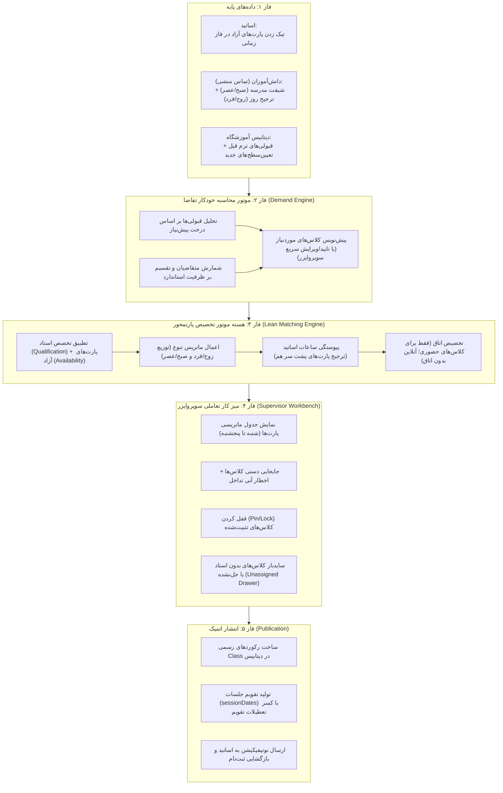

# معماری چابک و پارتمحور زمان‌بندی و کلاس‌بندی آموزشگاه (Scheduling Architecture)

> **وضعیت سند:** تصویب‌شده (Active Single Source of Truth)  
> **نسخه:** ۲.۰  
> **تاریخ بازنگری:** پاییز ۱۴۰۳  
> **جایگزین:** مستندات ۳۳ گانه قدیمی (آرشیو شده در `docs/archive/legacy-mvp/`)

---

## ۱. فلسفه و انگیزه بازطراحی (Why This Architecture?)

در پیاده‌سازی اولیه (MVPهای ۳۳ گانه)، فرآیند زمان‌بندی با نگاهی صرفاً آکادمیک و متصل به الگوریتم‌های پیچیده شناور طراحی شده بود. این امر منجر به ایجاد ۱۸ سرویس مجزا، اسنپ‌شات‌های تودرتو و فرضیات غیرواقعی از بیزینس آموزشگاه زبان شده بود (نظیر فرض پر کردن تقویم هفتگی روزانه/ساعتی توسط تک‌تک زبان‌آموزان یا نیاز به ورود دستی تقاضای کلاس‌ها توسط سوپروایزر).

در معماری جدید:

1. **انطباق ۱۰۰٪ با واقعیت آموزشگاه:** جریان بر مدار «فازهای زمانی و پارت‌ها (Operating Phases & Slots)» می‌چرخد.
2. **محاسبه خودکار تقاضا:** تقاضای هر سطح مستقیماً از کارنامه قبولی‌های ترم قبل (`isPassed`) و پیش‌ثبت‌نام‌های جدید استخراج می‌شود.
3. **تنوع سبد زمانی (Course Offering Spread):** برای جلوگیری از ریزش زبان‌آموزان به دلیل شیفت مدرسه یا مشغله کاری، کلاس‌های یک سطح در روزهای زوج/فرد و شیفت‌های صبح/عصر متوازن می‌شوند.
4. **سوپروایزر در نقش تصمیم‌گیرنده:** اتوماسیون ۸۰٪ چیدمان را انجام می‌دهد و ۲۰٪ آخر از طریق یک «میز کار تعاملی شبیه تقویم هفتگی» با امکان درگ، جابجایی و قفل کردن (Lock) در اختیار سوپروایزر قرار می‌گیرد.

---

## ۲. جریان سرتاسری عملیات (End-to-End Operational Flow)

---

## ۳. اجزای اصلی معماری

### ۳.۱. موتور محاسبه خودکار تقاضا (`SchedulingDemandService`)

دیگر نیازی به ورود دستی توسط سوپروایزر نیست:

- **ورودی‌ها:** شناسه ترم جدید (`TermId`) و شعبه مورد نظر.
- **تحلیل سوابق قبولی:**
  - استخراج رکوردهای `Enrollment` ترم پیشین با شرط `isPassed === true`.
  - یافتن دوره بعدی از طریق رابطه `Course.nextCourses` (یا `Course.prerequisiteId`).
- **تحلیل متقاضیان جدید:**
  - زبان‌آموزانی که تعیین‌سطح شده و دوره مجاز آن‌ها در `User.allowedCourses` مشخص شده اما هنوز در ترم فعال کلاسی نگرفته‌اند.
- **فرمول تقاضا:**
  $$\text{تعداد کلاس پیشنهادی} = \lceil \frac{\text{کل قبولی‌ها} + \text{متقاضیان جدید}}{\text{ظرفیت استاندارد دوره (مثلاً ۱۴)}} \rceil$$
- **خروجی:** تولید رکوردهای پیش‌نویس `ClassRequirement` با امکان تنظیم نسبت «حضوری / آنلاین» توسط سوپروایزر.

---

### ۳.۲. زیرساخت پارت‌های زمانی (`OperatingPhase`)

زمان‌بندی آموزشگاه بر مدار بازه‌های زمانی ۹۰ دقیقه‌ای استاندارد تعریف‌شده در `InstituteOperatingPhase` است:

- متد `calculatePhaseSlots(startTime, endTime, slotDurationMinutes, breakOptions)` پارت‌ها را استخراج می‌کند.
- **پارت ۱:** ۱۵:۰۰ تا ۱۶:۳۰
- **پارت ۲:** ۱۶:۴۵ تا ۱۸:۱۵
- **پارت ۳:** ۱۸:۳۰ تا ۲۰:۰۰
- تفکیک مسیرهای روزانه:
  - **مسیر روزهای زوج (Even Track):** شنبه، دوشنبه، چهارشنبه.
  - **مسیر روزهای فرد (Odd Track):** یکشنبه، سه‌شنبه.
  - **مسیر آخر هفته / شناور:** پنجشنبه / جمعه.

---

### ۳.۳. هسته تخصیص و قوانین چیدمان (`SchedulingEngineService`)

#### الف) قیود سخت (Hard Constraints)

1. **صلاحیت تدریس:** استاد باید رکورد معتبر در `TeacherCourseQualification` برای آن دوره داشته باشد.
2. **آمادگی زمانی استاد:** استاد باید در آن روز و پارت در `TeacherAvailability` اعلام آمادگی کرده باشد.
3. **عدم تداخل استاد:** هیچ استادی نمی‌تواند در یک روز و پارت در دو کلاس متفاوت حضور داشته باشد.
4. **تخصیص اتاق فیزیکی:**
   - **کلاس‌های آنلاین (`ONLINE`):** نیاز به اتاق ندارند (`classroomId = null`).
   - **کلاس‌های حضوری (`IN_PERSON`):** اتاقی انتخاب می‌شود که ظرفیت آن $\ge$ ظرفیت کلاس باشد و در آن پارت خالی باشد.

#### ب) ماتریس تنوع سبد کلاسی (Diversity & Course Offering Spread)

اگر برای یک دوره بیش از یک کلاس مورد نیاز باشد، الگوریتم آن‌ها را در یک زمان یا یک روز انباشته نمی‌کند:

| تعداد کلاس موردنیاز دوره | توزیع پیشنهادی در پارت‌ها و روزها                            | پوشش نیاز زبان‌آموز                                 |
| :----------------------- | :----------------------------------------------------------- | :-------------------------------------------------- |
| **۱ کلاس**               | پارت بهینه بر اساس بیشترین آمار شیفت دانش‌آموزان (مثلاً عصر) | پوشش حداکثری متقاضیان                               |
| **۲ کلاس**               | **۱ کلاس روز زوج عصر + ۱ کلاس روز فرد عصر (یا صبح)**         | انتخاب کامل بین روزهای زوج و فرد                    |
| **۳ کلاس**               | **۱ کلاس زوج عصر + ۱ کلاس فرد عصر + ۱ کلاس شیفت صبح**        | پوشش کامل هر دو شیفت مدرسه (صبحی‌ها و بعدازظهری‌ها) |
| **۴ کلاس یا بیشتر**      | توزیع متقارن در ۴ وضعیت (زوج عصر، زوج صبح، فرد عصر، فرد صبح) | انعطاف‌پذیری ۱۰۰٪ زمان ثبت‌نام                      |

#### ج) پیوستگی ساعات استاد (Back-to-Back Heuristic)

برای صرفه‌جویی در وقت اساتید، الگوریتم ترجیح می‌دهد پارت‌های پشت سر هم (مثلاً پارت ۱ و ۲) را به یک استاد اختصاص دهد، نه پارت‌های منقطع با ساعت بیکاری طولانی (مثلاً پارت ۱ و ۴).

---

### ۳.۴. میز کار تعاملی سوپروایزر (`Supervisor Workbench UI`)

صفحه‌ای ماتریسی و کاربرپسند در پنل ادمین:

1. **جدول ماتریسی پارت‌ها:**
   - نمایش واضح کارت‌های کلاسی در خانه‌های متناظر (روز $\times$ پارت).
   - نمایش مشخصات کلیدی: نام دوره، نام استاد، نام اتاق یا برچسب آنلاین، تعداد ظرفیت.
2. **سایدبار کلاس‌های تعیین‌تکلیف‌نشده (Unassigned Drawer):**
   - کلاس‌هایی که به دلیل نبود استاد واجد شرایط، پر بودن پارت یا کمبود اتاق جا نشده‌اند.
3. **امکانات تعاملی:**
   - جابجایی دستی بین پارت‌ها همراه با اخطار هوشمند تعارض در صورت عدم آمادگی استاد.
   - امکان **قفل کردن (Pin/Lock)** کلاس برای حفظ جایگاه آن در صورت اجرای مجدد بهینه‌سازی خودکار.

---

### ۳.۵. سرویس انتشار اتمیک (`SchedulingPublicationService`)

تبدیل خروجی تاییدشده به رکوردهای عملیاتی در یک تراکنش دیتابیس (`prisma.$transaction`):

1. ثبت کلاس‌ها در مدل `Class`.
2. استخراج تاریخ‌های دقیق برگزاری جلسات (`sessionDates`) با در نظر گرفتن:
   - روزهای برگزاری کلاس (`daysOfWeek`).
   - تاریخ شروع و پایان ترم (`Term.startDate` تا `Term.endDate`).
   - کسر روزهای تعطیل ثبت‌شده در تقویم (`InstituteCustomOffDay`).
3. ارسال اطلاعیه به پنل اساتید و انتشار کلاس‌ها برای ثبت‌نام.

---

## ۴. مقایسه معماری جدید و قدیم

| شاخص                       | معماری قدیم (MVP ۳۳ گانه)                  | معماری چابک جدید (نسخه ۲.۰)                               |
| :------------------------- | :----------------------------------------- | :-------------------------------------------------------- |
| **تعداد سرویس‌های بک‌اند** | ۱۸ سرویس تودرتو و وابسته به هم             | ۳ سرویس شفاف (`Demand`, `Engine`, `Publication`)          |
| **ورودی تقاضای دوره**      | تایپ دستی تک‌تک کلاس‌ها توسط سوپروایزر     | **محاسبه خودکار از قبولی‌های ترم قبل + تعیین‌سطح**        |
| **اطلاعات دانش‌آموز**      | تقویم هفتگی ریزساعتی پیچیده (غیرقابل اجرا) | **شیفت مدرسه ساده (صبح/عصر) + ترجیح روز (زوج/فرد)**       |
| **مبنای زمان‌بندی**        | اسلات‌های شناور ۳۰ دقیقه‌ای انتزاعی        | **پارت‌های استاندارد فاز زمانی (`OperatingPhase`)**       |
| **تجربه کاربری سوپروایزر** | مشاهده ماتریس اسکور و ارورهای ریاضی پیچیده | **میز کار بصری تقویم هفتگی با قابلیت درگ، سایدبار و قفل** |
| **پایداری و تست‌پذیری**    | وابستگی به زنجیره‌ای از اسنپ‌شات‌ها        | تست‌های واحد مجزا و قابل اتکا برای هر سناریوی واقعی       |
