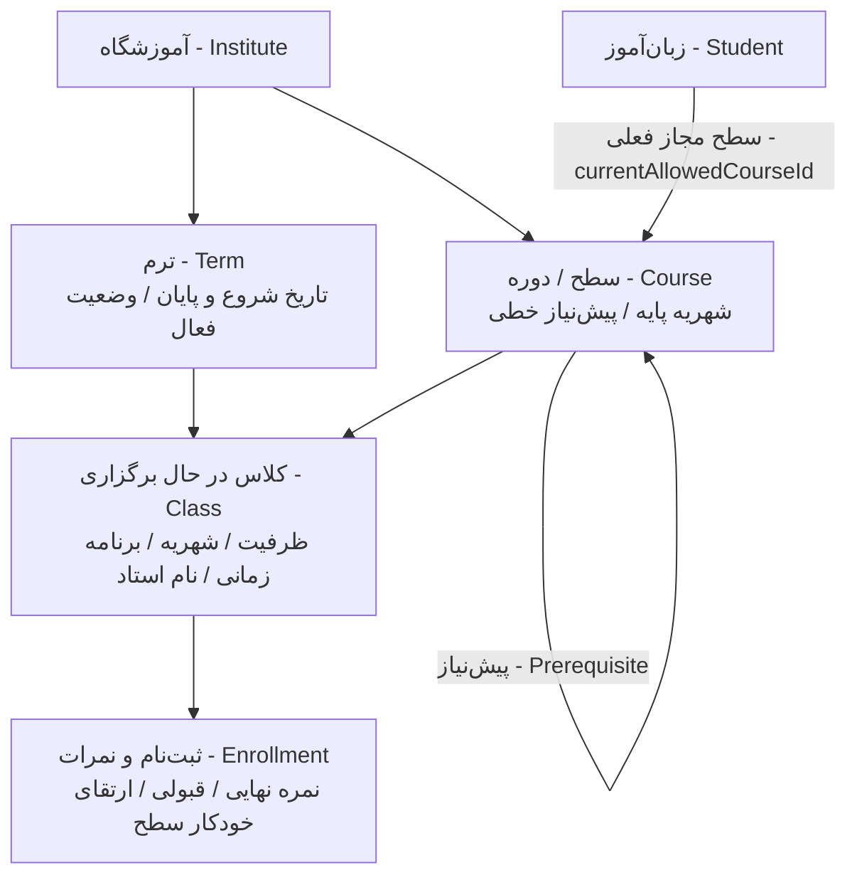

# سند پیاده‌سازی و اجرای PRD_01_education_classes: ساختار آموزشی و مدیریت کلاس‌ها (Education Structure & Classes)

**مرجع نیازمندی‌ها:** [`docs/PRD_01_education_classes.md`](../PRD_01_education_classes.md) | [`docs/PRD_base.md`](../PRD_base.md) | [`docs/TECH_base.md`](../TECH_base.md)  
**مرجع دیزاین سیستم:** [`DESIGN.md`](../../DESIGN.md)  
**وضعیت:** در حال آماده‌سازی و توسعه (Ready for Execution)

---

## ۱. نمای کلی و معماری دامنه آموزشی

این سند مراحل اجرایی پیاده‌سازی زیرسیستم ساختار آموزشی، سلسله‌مراتب درختی آموزشگاه (ترم، سطح/دوره، کلاس)، مدیریت زنجیره پیش‌نیازها، تعیین سطح مجاز زبان‌آموزان و فرآیند ثبت نمرات پایان ترم و ارتقای سطح خودکار را مشخص می‌کند:

---

## ۲. مشخصات لایه‌ها و پکیج‌های درگیر

### الف) پکیج انواع و اسکیماهای مشترک (`packages/types`)

1. **اسکیماهای ترم (`terms`):**
   - `CreateTermSchema`: عنوان ترم (`title`), تاریخ شروع (`startDate`), تاریخ پایان (`endDate`), وضعیت فعال (`isActive`).
   - `UpdateTermSchema`: ویرایش مشخصات ترم.
   - `TermSchema` و نوع استخراج‌شده `TermDto`.
2. **اسکیماهای دوره / سطح (`courses`):**
   - `CreateCourseSchema`: عنوان سطح (`title`), شهریه پایه (`baseFee`), شناسه پیش‌نیاز اختیاری (`prerequisiteId`).
   - `UpdateCourseSchema`: ویرایش سطح و زنجیره پیش‌نیاز.
   - `CourseTreeDto` جهت نمایش بصری پیش‌نیازها.
3. **اسکیماهای کلاس (`classes`):**
   - `CreateClassSchema`: عنوان کلاس (`title`), شناسه ترم (`termId`), شناسه سطح (`courseId`), ظرفیت (`capacity`), شهریه (`fee`), نام استاد (`teacherName`), برنامه زمان‌بندی هفتگی (`schedule`).
   - `UpdateClassSchema`: ویرایش اطلاعات کلاس.
   - `ClassFilterSchema`: فیلتر بر اساس ترم، سطح، وضعیت و جستجوی متنی.
4. **اسکیماهای نمرات و تعیین سطح (`grades`):**
   - `SubmitFinalGradesSchema`: آرایه‌ای از نمرات زبان‌آموزان کلاس شامل `studentId`, `finalScore` (0-100), `isPassed` (boolean).
   - `SetStudentLevelSchema`: تغییر سطح مجاز فعلی زبان‌آموز (`currentAllowedCourseId`).

---

### ب) پایگاه داده (`packages/database`)

مدل‌های `Term`, `Course`, `Class`, `Enrollment` و فیلد `currentAllowedCourseId` در مدل `User` از قبل در `schema.prisma` تعریف شده‌اند:

- رابطه `Course` با پیش‌نیاز خود به صورت Self-relation (`@relation("Prerequisite")`).
- فیلتر و اندیس‌گذاری بهینه بر اساس `[instituteId]`.
- رابطه `Class` با `Term` و `Course`.

---

### ج) بک‌اند (`apps/api` - NestJS)

1. **ماژول ترم‌ها (`src/terms`):**
   - `TermsController` & `TermsService`:
     - `GET /terms`: دریافت لیست ترم‌های آموزشگاه (با تفکیک `instituteId`).
     - `POST /terms`: ایجاد ترم جدید توسط مدیر آموزشگاه (`INSTITUTE_ADMIN`).
     - `PATCH /terms/:id`: ویرایش مشخصات یا تغییر وضعیت فعال/غیرفعال.
2. **ماژول دوره‌ها / سطوح (`src/courses`):**
   - `CoursesController` & `CoursesService`:
     - `GET /courses`: دریافت لیست سطوح آموزشی و زنجیره پیش‌نیازها.
     - `POST /courses`: تعریف سطح جدید با بررسی عدم ایجاد حلقه بازگشتی در پیش‌نیازها.
     - `PATCH /courses/:id`: ویرایش عنوان، شهریه پایه یا پیش‌نیاز سطح.
3. **ماژول کلاس‌ها (`src/classes`):**
   - `ClassesController` & `ClassesService`:
     - `GET /classes`: دریافت لیست کلاس‌ها با اطلاعات ترم، دوره و تعداد زبان‌آموزان ثبت‌نامی (`_count.enrollments`).
     - `GET /classes/available`: دریافت کلاس‌های مجاز برای زبان‌آموز لاگین کرده (بر اساس `user.currentAllowedCourseId` یا سطوح گذرانده شده).
     - `POST /classes`: ایجاد کلاس جدید با بررسی تطابق `instituteId` ترم و دوره با آموزشگاه.
     - `PATCH /classes/:id`: ویرایش ظرفیت، شهریه، برنامه زمانی یا استاد.
4. **ماژول ثبت نمرات و ارتقای سطح (`src/grades`):**
   - `GradesController` & `GradesService`:
     - `GET /classes/:id/students`: لیست زبان‌آموزان کلاس جهت ثبت نمره.
     - `POST /classes/:id/grades`: ثبت نمرات نهایی؛ در صورت `isPassed: true`، سطح مجاز کاربر (`currentAllowedCourseId`) به صورت خودکار به سطح بعدی زنجیره پیش‌نیاز ارتقا می‌یابد.

---

### د) پنل مدیریت آموزشگاه (`apps/admin-panel` - Next.js)

1. **مدیریت ترم‌ها (`/terms`):**
   - جدول ترم‌ها با نمایش وضعیت فعال/غیرفعال و بازه زمانی.
   - مودال ساخت و ویرایش ترم با انتخابگر تاریخ شمسی/میلادی.
2. **مدیریت دوره‌ها و سطوح (`/courses`):**
   - جدول سطوح آموزشی با نمایش پیش‌نیاز و شهریه پایه.
   - مودال ساخت/ویرایش سطح با کامبوباکس انتخاب سطح پیش‌نیاز.
3. **مدیریت کلاس‌ها (`/classes`):**
   - جدول کلاس‌ها با نمایش عنوان، سطح، ترم، استاد، ظرفیت پر شده/باقیمانده و شهریه.
   - فیلتر بر اساس ترم فعال و سطح آموزشی.
   - مودال ساخت و ویرایش کلاس با لود داینامیک ترم‌ها و دوره‌ها.
4. **صفحه ثبت نمرات کلاس (`/classes/[id]/grades`):**
   - جدول زبان‌آموزان ثبت‌نامی با اینپوت نمره (۰ تا ۱۰۰) و تاگل قبولی/مردودی.
   - دکمه ثبت نهایی با تاییدیه ارتقای خودکار سطح زبان‌آموزان قبول شده.

---

### هـ) اپلیکیشن نسخه زبان‌آموز (`apps/student-pwa` - Next.js PWA)

1. **صفحه انتخاب کلاس (`/classes`):**
   - نمایش سطح فعلی زبان‌آموز («سطح مجاز شما: Top Notch 1»).
   - کارت‌های کلاس‌های باز برای ثبت‌نام (شامل نام استاد، روز و ساعت برگزاری، ظرفیت باقیمانده، شهریه).
   - دکمه اقدام «انتخاب و ثبت‌نام» (هدایت به گام پرداخت در PRD_02).

---

## ۳. قوانین بیزینس و امنیتی (Business & Security Rules)

> [!IMPORTANT]
> **ایزولاسیون کامل چندمستاجری (Tenant Scoping):**
> تمامی کوئری‌های ترم، دوره و کلاس باید منحصراً شامل `where: { instituteId: currentUser.instituteId }` باشند.

> [!TIP]
> **ارتقای خودکار سطح (Progression Rule):**
> با ثبت نهایی قبولی (`isPassed = true`) یک زبان‌آموز، سیستم دوره بعدی را از رابطه پیش‌نیاز پیدا کرده و فیلد `user.currentAllowedCourseId` را به آن به‌روزرسانی می‌کند. اگر دوره بعدی وجود نداشته باشد، سطح فعلی بدون تغییر باقی می‌ماند.

> [!NOTE]
> **ثبت‌نام دستی توسط مدیر (Override Privilege):**
> مدیر آموزشگاه می‌تواند با تغییر دستی فیلد «سطح مجاز فعلی» در پروفایل کاربر، محدودیت پیش‌نیاز را برای زبان‌آموز بازتعریف کند.

---

## ۴. برنامه اعتبارسنجی و تست‌های چندلایه‌ای (Verification Plan)

1. **تست‌های اسکیما و انواع (Unit):**
   - اعتبارسنجی بازه نمرات (۰ تا ۱۰۰)، ظرفیت مثبت، اعتبارسنجی فرمت تاریخ.
2. **تست‌های سرویس‌های بک‌اند (Unit):**
   - تست جلوگیری از ایجاد حلقه در پیش‌نیازها.
   - تست منطق ارتقای خودکار `currentAllowedCourseId` با ثبت نمره قبولی.
   - تست ایزولاسیون دیتابیس آموزشگاه‌ها در ایجاد کلاس و ترم.
3. **تست‌های یکپارچگی HTTP بک‌اند (E2E):**
   - اندپوینت‌های `/terms`, `/courses`, `/classes`, `/classes/:id/grades`.
4. **تست‌های کامپوننت‌های فرانت‌اند (Vitest + RTL):**
   - تست فرم ساخت ترم، دوره و کلاس در `apps/admin-panel`.
   - تست کارت‌های نمایش کلاس در `apps/student-pwa`.
