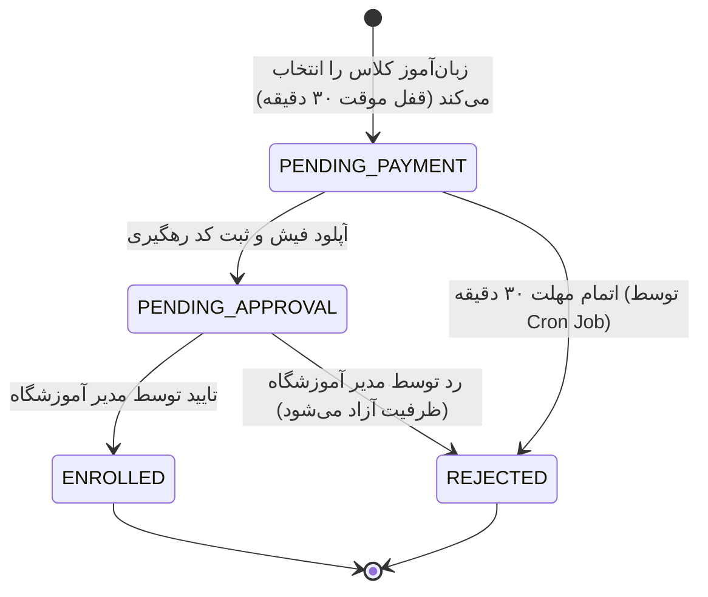

# سند پیاده‌سازی و اجرای PRD_01_finance: ثبت‌نام و امور مالی (Registration & Finance)

**مرجع نیازمندی‌ها:** [`docs/PRD_01_finance.md`](../PRD_01_finance.md) | [`docs/PRD_base.md`](../PRD_base.md) | [`docs/TECH_base.md`](../TECH_base.md)  
**مرجع دیزاین سیستم:** [`DESIGN.md`](../../DESIGN.md)  
**وضعیت:** در حال آماده‌سازی و توسعه (In Progress)

---

## ۱. نمای کلی و معماری فنی

این سند مراحل اجرایی پیاده‌سازی زیرسیستم ثبت‌نام کلاس‌ها، امور مالی فیش‌های بانکی، قفل موقت ظرفیت کلاس‌ها (Soft Lock) و گردش کار تایید/رد مدیریت را مشخص می‌کند:

1. **پکیج انواع اشتراکی (`packages/types`):**
   - اسکیماهای Zod برای تراکنش‌های مالی، وضعیت‌های ثبت‌نام، آپلود فیش و اعتبارسنجی کد رهگیری.
   - تایپ‌های فیلتر و آمار مالی (در انتظار تایید، تایید شده، رد شده).
2. **پایگاه داده (`packages/database`):**
   - مدل `Transaction` با وضعیت‌های `PENDING`، `APPROVED` و `REJECTED`.
   - مدل `Enrollment` با وضعیت‌های `PENDING_PAYMENT`، `PENDING_APPROVAL`، `ENROLLED`، `REJECTED` و `WAITLISTED`.
   - ایجاد اندیس‌های بهینه روی `[instituteId, status]` و `[trackingCode, instituteId]`.
3. **بک‌اند (`apps/api` - NestJS):**
   - ماژول `FinanceModule` / `TransactionsModule`:
     - مدیریت آپلود تصویر فیش و ثبت تراکنش با قفل ۳۰ دقیقه‌ای ظرفیت کلاس.
     - بررسی کد رهگیری تکراری جهت الصاق تگ هشدار هوشمند (`isDuplicateWarning`).
     - مسیرهای تایید (`POST /transactions/:id/approve`) و رد (`POST /transactions/:id/reject`).
   - سرویس پس‌زمینه (Cron Job) با `@nestjs/schedule`:
     - پایش و آزادسازی خودکار ظرفیت کلاس‌های در حال پرداخت (`PENDING_PAYMENT`) بعد از گذشت ۳۰ دقیقه.
4. **پنل مدیریت آموزشگاه (`apps/admin-panel` - Next.js):**
   - صفحه مدیریت تراکنش‌ها و فیش‌ها در مسیر `/transactions`:
     - تب فیش‌های در انتظار تایید با نمایش هشدار بصری ⚠️ برای کدهای رهگیری تکراری.
     - پیش‌نمایش تصویر فیش واریزی در مدال تمام‌صفحه/بزرگنمایی.
     - امکان تایید یا رد سریع با ثبت دلیل/توضیح.
5. **نسخه زبان‌آموز (`apps/student-pwa` - Next.js PWA):**
   - فرایند ثبت‌نام کلاس:
     - انتخاب کلاس مجاز و نمایش شهریه + اطلاعات کارت و شبای آموزشگاه.
     - تایمر شمارش معکوس ۳۰ دقیقه‌ای رزرو صندلی.
     - فرم آپلود عکس فیش و ثبت کد پیگیری.

---

## ۲. وضعیت‌های ثبت‌نام و گردش کار مالی

---

## ۳. قوانین تجاری و فنی کلیدی (Business & Technical Rules)

> [!IMPORTANT]
> **پرداخت یکجا و کامل شهریه:**
> در فاز اول (MVP) پرداخت اقساطی یا بیعانه وجود ندارد. سیستم فقط ثبتِ پرداخت کامل شهریه کلاس را می‌پذیرد.

> [!WARNING]
> **رفتار هوشمند در قبال کد رهگیری تکراری:**
> سیستم هیچ درخواستی را به دلیل تکراری بودن کد رهگیری مسدود نمی‌کند (ممکن است پرداخت توسط یک والد برای دو فرزند انجام شده باشد). در عوض، یک نشانگر هشدار (`isDuplicate: true`) در پنل مدیریت کنار فیش درج می‌شود.

> [!NOTE]
> **جداسازی مستاجر در تراکنش‌ها:**
> تمامی جستجوها و تغییرات تراکنش‌ها و ثبت‌نام‌ها باید منحصراً به `instituteId` کاربر لاگین کرده محدود باشد.

---

## ۴. لیست تغییرات و ساختار فایل‌ها (Action Plan)

### الف) پکیج انواع اشتراکی (`packages/types`)

- اسکیماهای `CreateTransactionSchema`, `ReviewTransactionSchema`, `TransactionFilterSchema`.
- اینام `TransactionStatusEnum` و `EnrollmentStatusEnum`.

### ب) بک‌اند (`apps/api`)

- `src/transactions/transactions.module.ts`
- `src/transactions/transactions.service.ts`
- `src/transactions/transactions.controller.ts`
- `src/transactions/cron/expired-reservations.service.ts`
- اکشن‌های لاگین‌محور برای بررسی و تایید/رد فیش‌ها.

### ج) پنل مدیریت آموزشگاه (`apps/admin-panel`)

- `lib/api/resources/transactions.resource.ts`
- `app/[locale]/(admin)/transactions/page.tsx`
- ساب‌کامپوننت‌های مربوطه (`transactions-table`, `receipt-preview-modal`, `duplicate-warning-badge`, `review-action-dialog`).
- پیام‌های محلی‌سازی `messages/{fa,en}/transactions.json`.

### د) اپلیکیشن زبان‌آموز (`apps/student-pwa`)

- `lib/api/resources/enrollment.resource.ts`
- `app/[locale]/(student)/classes/[id]/payment/page.tsx`
- کامپوننت‌های تایمر معکوس (`soft-lock-timer`)، کارت حساب آموزشگاه و فرم ارسال فیش.

---

## ۵. برنامه اعتبارسنجی و تست‌ها (Verification Plan)

1. **تست همزمانی ظرفیت صندلی:** اطمینان از عدم ثبت‌نام بیش از سقف کلاس در زمان انتخاب همزمان دو کاربر.
2. **تست تایمر ۳۰ دقیقه و کران‌جاب:** بررسی بازگشت ظرفیت کلاس پس از انقضای تایمر بدون پرداخت.
3. **تست هشدار فیش تکراری:** ثبت دو فیش با یک کد رهگیری در یک آموزشگاه و بررسی علامت هشدار در پنل مدیر.
4. **تست تایید و رد:** بررسی تغییر وضعیت ثبت‌نام به `ENROLLED` در صورت تایید و آزادسازی ظرفیت در صورت رد.
